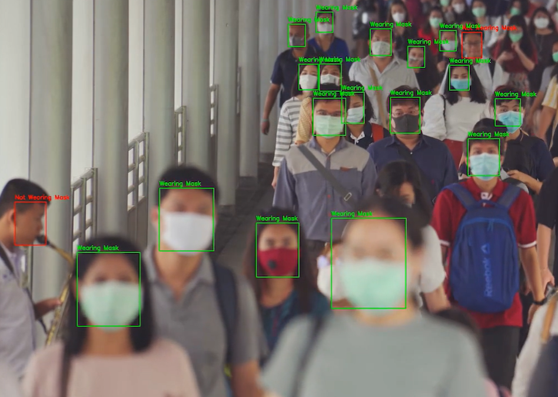
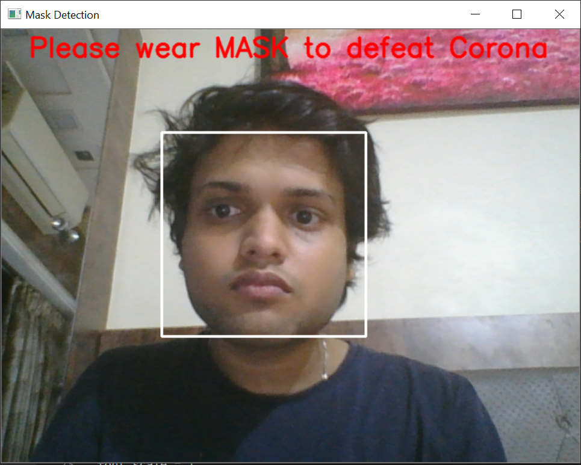

# Face-Mask-Detection-uisng-Open-CV-

Our motto is to detect facial mask monitoring using Open CV and Python to stop the flow of corona virus.

# Introduction :- 
Corona Virus disease has spread to more than 213 countries infecting more than 7 million people and killing over 403,202 globally, according to data compiled by world-ometer.

# Aim :- 
To limit Corona Virus spread, social distancing and observing hygiene standards like compulsory wearing of mask, use of hand gloves, face shield, and use of sanitizer is very important.

# Objective :- 
Many Organizations are making it compulsory to follow social distancing and wearing of face mask This , explains how to detect facial mask monitoring using Open CV and Python.

# ALGORITHM :- 

# Step 1: Identify Face and Mouth

 Steps for Face Prediction using Python and OpenCV are:

1.Create HAAR Cascade object using ‘CascadeClassifier’ function and ‘haarcascade_frontalface_default.xml’.

2.Read image using function ‘imread’ (or ‘read’ for video/ camera input) function.

3.Convert in gray scale using ‘cvtColor’ function.

4.Detect face using ‘detectMultiScale’ function.

# Step 2: Identify Person is using Mask or not.

As shown in code, there are three rectangle objects:

1.‘Gray’ image face rectangle.

2.‘Black & White’ image face rectangle.

3.‘Gray’ image Mouth rectangle.

# When Mass Detected :- 

# When Mass not Detected 

